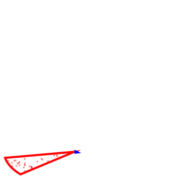
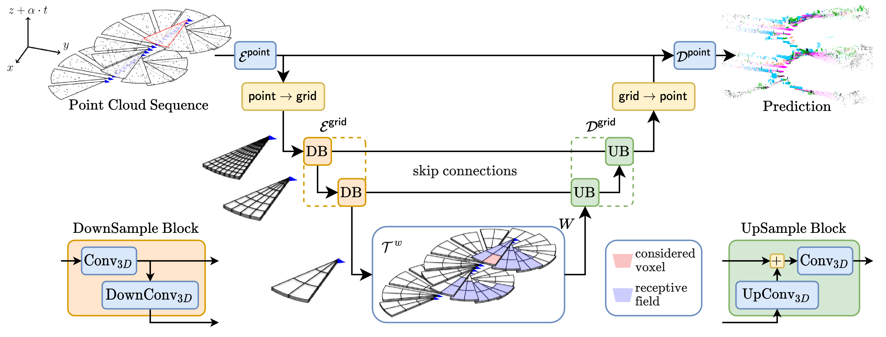

<div align="center">
  <h1>Online Segmentation of LiDAR Sequences:</h1>
  <h1>Dataset and Algorithm</h1>
  
</div>


## Description
Official PyTorch implementation of the paper [**"Online Segmentation of LiDAR Sequences: Dataset and Algorithm"**]().

Please visit our [**webpage**](https://romainloiseau.fr/helixnet/) for more details.



#### Bibtex
If you find this code useful in your research, please cite:

```
@article{loiseau22online,
  title={Online Segmentation of LiDAR Sequences: Dataset and Algorithm.},
  author={Romain Loiseau and Mathieu Aubry and Loïc Landrieu},
  journal={arXiv:2206.08194},
  month={June},
  year={2022}
}
```

## Installation :construction_worker:

### 1. Clone the repository in recursive mode

```
git clone git@github.com:romainloiseau/Helix4D.git --recursive
```

### 2. Clone, create and activate conda environment

```
conda env create -f environment.yml
conda activate helix4d_conda
```

**Optional:** some monitoring routines are implemented with `tensorboard`.

**Note:** this implementation uses [`spconv`](https://github.com/traveller59/spconv) for sparse convolutions, [`pytorch_lightning`](https://www.pytorchlightning.ai/) for all training routines and [`hydra`](https://hydra.cc) to manage configuration files and command line arguments.

### 3. Datasets

This implementation uses dedicated modules to perform slice-splitting on [HelixNet](https://romainloiseau.fr/helixnet/) and [Semantic-KITTI](http://www.semantic-kitti.org/) datasets that can be found [here](https://github.com/romainloiseau/HelixNet). HelixNet's toolbox is used as a submodule for this repository.

Go to the website of desired datasets and download them at `/path/to/datasets/` and use `data.data_dir=/path/to/datasets/dataset-name` as a command line argument for python to find your path when using this implementation.

## How to use :rocket:

### Training the model

To train our best model, launch :
```bash
python main.py \
  +data=dataset \
  +experiment=ours
```

#### Current available datasets
- `helixnet`: HelixNet (9 classes)
- `semantic-kitti`: Semantic-KITTI (20 classes)
- `semantic-kitti-all`: Semantic-KITTI with moving objects (26 classes)

### Testing the model

To test the model, launch :
```bash
python main.py \
  +data=dataset \
  +experiment=ours \
  mode=test \
  model.load_weights="/path/to/trained/weights.ckpt"
```

**Note:** pretrained weights to come in `pretrained_models/`


### Reproduce results

To reproduce the <b>Table 4: Ablation Study</b> of the paper using slurm jobs, launch :
```bash
python ablations.py
```

### Citation   
```
@article{loiseau22online,
  title={Online Segmentation of LiDAR Sequences: Dataset and Algorithm.},
  author={Romain Loiseau and Mathieu Aubry and Loïc Landrieu},
  journal={arXiv:2206.08194},
  month={June},
  year={2022}
}
```
